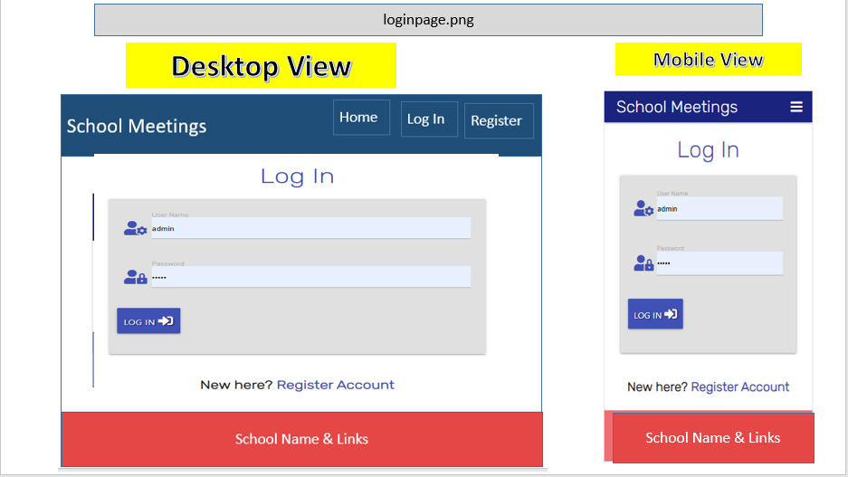

<h1 align="center">School Meetings Management Website </h1>

[View the live project here.](https://flask-school-mgt-project.herokuapp.com/)

This is an Event Management Website for friends/families to share events. It is designed to be responsibe and accessible on a range of devices, making it easy to navigate for people working on desktop, labtop or mobile.


** Site set up as a School Management Site

<h2 align="center"></h2>

## User Experience (UX)

-   ### User stories

    -   #### First Time Visitor Goals

        1. <i>As a First Time Visitor</i>, I want to easily understand the main purpose of the site and learn more about what it can do for me.
        2. <i>As a First Time Visitor</i>, I want to be able to easily navigate throughout the site to find content and get an idea of what use it is.
        3. <i>As a First Time Visitor</i>, I want to be able to see how it would help me make logging meetings and checking for meetings simpler.

    -   #### Returning Visitor Goals

        1. As a Returning Visitor, I want to log in easily.
        2. As a Returning Visitor, I want to be able to add to this meeting schedule.
        3. As a Returning Visitor, I want to add meetings and see other school meetings.

    -   #### Frequent User Goals
        1. As a Frequent User, I want to check to see if anyone has updated the database with new meetings.
        2. As a Frequent User, I want to check to see if anyone has deleted any meetings.
        3. As a Frequent User, I want to be able to add meetings and check updates.

-   ### Design
    -   #### Colour Scheme
        -   The three main colours used are indigo, red and grey.
        The colours used are bright and contrast well with each other. I sourced the colours using Materalize webiste - CSS. They are linked to the school colours of indigo and red.

        https://materializecss.com/color.html

    -   #### Typography
        -   The rubik font is the main font used throughout the whole website.
        Rubik Beastly is an original, script-generated design based on the Google Fonts. They designed a slightly rounded heavyweight font in which the letters fit perfectly in a single cubelet of the Rubik's Cube. It is clear and easily to read, and useful in a professional setting. 

    -   #### Imagery
        -   Imagery is important to this site. The large, background image is designed to be appealing and catch the user's attention as to what the webiste is for. It also has a modern feel which would relate to events/parties.

        Background image for site pages
        
        
        I used the school logo as the main image for the project. This image is used for development purposes only. 

*   ### Wireframes

Home Page  


Register Page  


Log In  



Profile Page  


Add Category - People


Add task - Event


## Features

-   Responsive on all device sizes

-   Interactive elements

-   Flash messages so the user gets clear messages 

-   Simple features and user friendly

## Technologies Used

### Languages Used

-   [HTML5]
-   [CSS3]


### Frameworks, Libraries & Programs Used


1. [Balsamiq:](https://balsamiq.com/)
    - Balsamiq was used to create the wireframe images during the design process.
1. [Google Fonts:](https://fonts.google.com/)
    - Google fonts were used to import the 'Sans-Serif' font into the style.css file which is used on all pages throughout the project.
1. [Font Awesome:](https://fontawesome.com/)
    - Font Awesome was used most pages throughout the website to add icons for aesthetic and UX purposes. They have a large library of icons to choose from. 
1. [jQuery:](https://jquery.com/)
    - jQuery used for the smooth scroll function in JavaScript.
1. [Git](https://git-scm.com/)
    - Git was used for version control by utilizing the Gitpod terminal to commit to Git and Push to GitHub.
1. [GitHub:](https://github.com/)
    - GitHub is used to store the projects code after being pushed from Git.
1. [Materalize:](https://materializecss.com/)
    - Materialize is described as a "modern responsive front-end framework based on Material Design" which allows the developer to use a variety of pre-written code. 
1. [Mongdodb.com](https://www.mongodb.com/)
    - MongoDB is used Cloud-hosted  service on AWS, Azure and Google Cloud. Deploy, operate, and scale a MongoDB database in just a few clicks
1. [Heroku.com](https://id.heroku.com/login)
    - Heroku is a platform as a service (PaaS) that enables developers to build, run, and operate applications entirely in the cloud.
1.  [Werkzeug.com](https://werkzeug.palletsprojects.com/)
    - Werkzeug is a comprehensive WSGI web application library.  WSGI is the Web Server Gateway Interface. It is a specification that describes how a web server communicates with web applications, and how web applications can be chained together to process one request. I used this for a variety of secure passwords.


## Testing

The W3C Markup Validator and W3C CSS Validator Services were used to validate every page of the project to ensure there were no syntax errors in the project.

-   [W3C Markup Validator](https://jigsaw.w3.org/css-validator/#validate_by_uri) - [Results](https://jigsaw.w3.org/css-validator/validator?uri=https%3A%2F%2Fctoweyburke.github.io%2Fschool_managment_ms3%2F&profile=css3svg&usermedium=all&warning=1&vextwarning=&lang=en)
-   [W3C CSS Validator](https://validator.w3.org/#validate_by_uri)- [Results](https://validator.w3.org/nu/?doc=https%3A%2F%2Fctoweyburke.github.io%2Fschool_managment_ms3%2F)
-   [Developers Speed Google](https://developers.google.com/speed/pagespeed/insights/) - [Results](https://developers.google.com/speed/pagespeed/insights/?url=https%3A%2F%2Fdevelopers.google.com%2Fspeed%2Fpagespeed%2Finsights%2F)

-   [Lighthouse](developers tool)
    
 


### Testing User Stories from User Experience (UX) Section

-   #### First Time Visitor Goals


    1. As a First Time Visitor, I want to easily understand the main purpose of the site and learn more about its use.

        1. Upon entering the site, users are automatically greeted with a clean and easily readable navigation bar to go to the page of their choice. There is a background image and a title of Events Manager, along with "All Events" on the main page.
        2. The main site idea is evident immediately with the image giving the user the idea of an event or party.
        3. The user has two options, click the Log in or Register buttons or scroll down through the events already entered.

    2. As a First Time Visitor, I want to be able to easily navigate throughout the site to find content.

        1. The site has been designed to be light in colour and contrast. At the top of each page there is a clean navigation bar, each link describes what the page they will end up at clearly.
        3. First time use - users would need to register to gain access to edit/add their own events.

    3. As a First Time Visitor, I want to look at the events and see if they have key specific information. The tasks provide the user with the name of the person, along with the event and date. 
        1. Once the new visitor has registered, they will gain further navigation buttons to help them edit or delete any entries they input. 
        2. The user can also see other friends/families entries but cannot edit or delete them.
      
-   #### Returning Visitor Goals

    1. As a Returning Visitor, I want to see if any new events have been added and this is evidnet from loading the page.

        1. These are clearly shown in the All Events section.
        2. As a returning visitor I can also see who has entered them. 

    2. As a Returning Visitor, I want to add new people and events myself which is very easy to navigate.

        1. The navigation bar clearly shows "add/edit person" or "New Event" for new events.
        2. Here the user can add and contribute to this site.
        
    

-   #### Frequent User Goals

    1. As a Frequent User, I want to check to see if there are any newly added events.

        1. The user would already be comfortable with the website layout and can easily load the site.

    2. As a Frequent User, I want to add/edit my events or add new people.

        1. The user would already be comfortable with the website layout and can easily do this.


### Further Testing

-   The Website was tested on Google Chrome, Internet Explorer, Microsoft Edge and Safari browsers.
-   The website was viewed on a variety of devices such as Desktop, Laptop, iPhone7, iPhone 8 & Samsung Galaxy S21.
-   A large amount of testing was done to ensure that all pages were linking correctly.
-   Friends and family members were asked to review the site and documentation to point out any bugs and/or user experience issues.


### Known Bugs

- Mobile responsive - can take time - when looking at mobile view using developer tools, it sometimes does not resize and has to be reloaded to change to mobile view.

- Date picker - Issue with date showing on the events once a new event is added. I have tried several ways to fix this including the link from MongoDB, the code in app.py and edit_task.html. I cannot see where the error is to fix it. 

## Deployment


## Heroku Page

[Heroku Deployment](https://devcenter.heroku.com/articles/github-integration) 
This project was deployed to Heroku using the information from the site above and also using tutorials from Code Institute.


### GitHub Pages
The project was deployed to GitHub Pages using the following steps...

1. Log in to GitHub and locate the [GitHub Repository](https://ctoweyburke.github.io/school_managment_ms3/)
2. At the top of the Repository (not top of page), locate the "Settings" Button on the menu.
    - Alternatively Click [Here](https://raw.githubusercontent.com/) for a GIF demonstrating the process starting from Step 2.
3. Scroll down the Settings page until you locate the "GitHub Pages" Section.
4. Under "Source", click the dropdown called "None" and select "Master Branch".
5. The page will automatically refresh.
6. Scroll back down through the page to locate the now published site [link](https://ctoweyburke.github.io/school_managment_ms3/) in the "GitHub Pages" section.

### Forking the GitHub Repository

By forking the GitHub Repository we make a copy of the original repository on our GitHub account to view and/or make changes without affecting the original repository by using the following steps...

1. Log in to GitHub and locate the [GitHub Repository](https://github.com/)
2. At the top of the Repository (not top of page) just above the "Settings" Button on the menu, locate the "Fork" Button.
3. You should now have a copy of the original repository in your GitHub account.

### Making a Local Clone

1. Log in to GitHub and locate the [GitHub Repository](https://github.com/)
2. Under the repository name, click "Clone or download".
3. To clone the repository using HTTPS, under "Clone with HTTPS", copy the link.
4. Open Git Bash
5. Change the current working directory to the location where you want the cloned directory to be made.
6. Type `git clone`, and then paste the URL you copied in Step 3.

```
$ git clone https://github.com/YOUR-USERNAME/YOUR-REPOSITORY
```

7. Press Enter. Your local clone will be created.

```
$ git clone https://github.com/YOUR-USERNAME/YOUR-REPOSITORY
> Cloning into `CI-Clone`...
> remote: Counting objects: 10, done.
> remote: Compressing objects: 100% (8/8), done.
> remove: Total 10 (delta 1), reused 10 (delta 1)
> Unpacking objects: 100% (10/10), done.
```

Click [Here](https://help.github.com/en/github/creating-cloning-and-archiving-repositories/cloning-a-repository#cloning-a-repository-to-github-desktop) to retrieve pictures for some of the buttons and more detailed explanations of the above process.


## Credits

### Code

- The entire website code was written based on the tutorial on the backend development milestone project by [Code Institute](https://codeinstitute.net)

-   The full-screen background image came from [Shutterstock](https://www.shutterstock.com/image-vector/set-pink-white-transparent-confetti-helium-1122183473)

-   [Materalize](https://materializecss.com/): Materialize site used for a variety of code - Card Panels, buttons, forms, Javascript Side Nav and Nav Bar.


### Content

-   All content was written by the developer using the Code Institute Tutorial on the backend development milestone project by [Code Institute](https://codeinstitute.net). The content has been adapted to suit the site needs. 


### Media

-   Icons were used from this site - [Font-Awesome](https://fontawesome.com/).
-   Images are used and hve been referenced above.


### Acknowledgements

-   My Mentor for continuous helpful feedback on my project.

-   Tutor support at Code Institute for their support, help, understanding and advice.